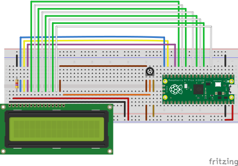

# Dino game on a Raspberry Pi Pico
My attempt at making a minimalistic clone of the Chrome Dino game on a
Hitachi HD44780 display using a Raspberry Pi Pico.

## Where's the input?

The game requires only one input: a click/tap.

We could use a normal button and wire it on the breadboard, but in this case, I chose to use the **BOOTSEL button** on the picoboard (using code copied from the [pico-examples repository](https://github.com/raspberrypi/pico-examples/tree/master/picoboard/button)).

## Wiring
The wiring corresponds to the variable `LCDpins`, which takes the GPIO pin numbers as array values.

```c
// D0, D1, D2, D3, D4, D5, D6, D7, E, RS, RW, LCD columns, LCD rows
int LCDpins[14] = {12, 11, 10, 9, 8, 7, 6, 5, 13, 15, 14, 16, 2};
```



## Flowchart
[](https://mermaid.live/edit#pako:eNqVU1Fv2kAM_ivWPW0SUAiQkjxsaos2IVWiUvs0socjMeWk5BzdXcYo5b_PlwhImDppyUPsL58_22ffQaSUoYjFq5HlFl7miQZ-hp-enTTuc-P1-19gLS0utHKrRCj-KJmrN4TvT4slSJ3B48M8ET8vdOvDVzeJyJQtc7lvALCpQdSJuGlRd1K5b2QWuqzqCO_Dhgwoj3S5r7LAR6Ly4A3I2TrC5a8v7M6glt0iPbeGOxVupX2gPFcZZgemW3BbNAgSUo9aRfprIo5n_rumd9gZ5ZBbrcv09kUbHDWH0C5X2fvKOdJPBq1t5YF1DUPZ4B8kmitN98TEYnVKlzHkM61rGAztzj1d5bro7dG2BF-o_EvNUdmRusrenDxqNNLhcs2TTHO8YrLsB7SGeI1zDScIDC8QZ6FTSGtKjdEa1UmvA3U69RNZ_kLTXr56W4jBfy3gnSa_Av-1h76c0wsgeqJAU0iV8YU6eCQRLFlwSzGbGW5klbNSoo9MlZWj571ORbyRucWeqMpM-tOUfBeLM1pK_YOIfWeqxhXxQfwW8WgWDcbj23E4DkfjYTic9sRexP1gMh0Ew0kUzm5ns2gynR574q0WGA2CaBROoiAIOCwKg8nxD61oT9E)

## Building
I make use of the newer pico_rand API from the Pico SDK, which has been merged (#1111) into and is, as of now (2023/28/1), only available on the development branch of the Pico SDK repository.

```sh
mkdir pico # directory with the SDK and this project
cd pico

# clone the SDK which is on the 'develop' branch
git clone https://github.com/raspberrypi/pico-sdk.git -b develop

# clone this repo
git clone https://github.com/turtureanu/pico-dino.git

export PICO_SDK_PATH=$(realpath pico-sdk) # export the SDK, so we can use it when building
cd pico-dino
mkdir build
cd build
cmake ../
make
```

For generating the Doxygen documentation (to include the `pico_rand` API) see Appendix E of [the Pico SDK documentation](https://datasheets.raspberrypi.com/pico/raspberry-pi-pico-c-sdk.pdf).

## Licensing
This project is licensed under the [BSD 3-Clause "New" or "Revised" License](/LICENSE).

This project makes use of code from the [Raspberry Pi Pico SDK Examples GitHub repository](https://github.com/raspberrypi/pico-examples).

This project uses the [picoLCD library](https://github.com/zadi15/picoLCD).
